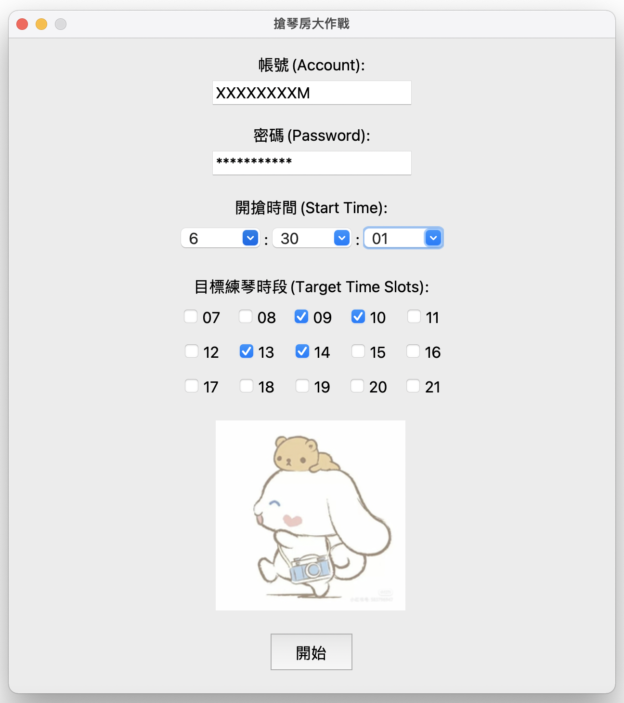

# 🔥 搶琴房大作戰 🔥

## 簡介

這是一個自動搶琴房的程式，使用 Selenium 驅動自動化瀏覽器進行操作。你可以在輸入帳號與密碼後，設定搶琴房的開始時間，以及選擇想要搶的練琴時段，程式將在指定的時間自動執行搶琴房任務。

## 如何使用

### 安裝相依套件

使用以下指令安裝所需的 Python 相依套件：

```console
pip install -r requirements.txt
```

### 打包應用程式

#### For MacOS

1. 執行以下指令：

    ```console
    python setup.py py2app
    ```

#### For Windows

1. 將程式碼中圖片讀取的檔案路徑修改為以下格式： 
   `r"C:\xxx\xxx"`

2. 執行以下指令：
    ```console
    pyinstaller -F .\piano_room.py -i 大耳狗.ico -w
    ```

### 執行應用程式

執行打包後的桌面程式，並在應用程式介面中填入以下資訊：

- 帳號 (Account)
- 密碼 (Password)
- 開搶時間 (Start Time)
- 目標練琴時段 (Target Time Slots)

最後按下 "開始" 按鈕，程式將在指定的時間自動執行，並在執行完畢後顯示提示訊息。

**👾 若是不想打包成桌面程式，也可直接透過 `python piano_room.py` 指令執行應用程式。**

## 介面預覽



## 注意事項

- 請確保主機已安裝 Chrome 瀏覽器。
- 此程式可以在背景執行，但請確保主機處於**非睡眠狀態**，或是開啟主機的**排程自動喚醒**功能。
- 由於此程式使用自動化工具，請確保你的使用符合網站的使用條款，以免觸發不當行為。

**⚠️ 注意：此程式僅供學習和研究之用，使用風險由使用者自行承擔。**
